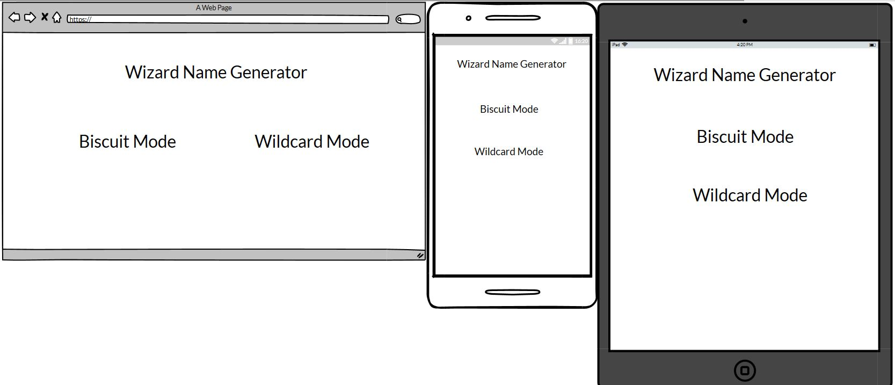
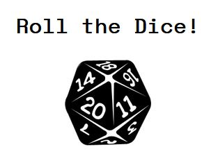
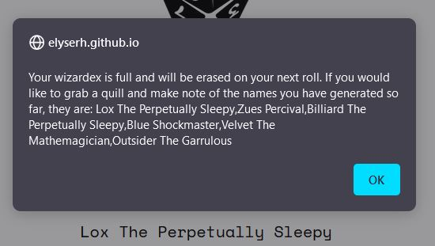
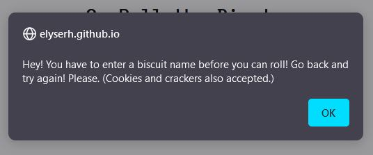
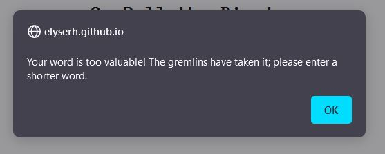

### Table of contents:

[Purpose](#purpose)

[User Stories](#user-stories) 

[Design and UX](#design-and-ux) 
* [Wireframes](#wireframes)
* [Colour schemes and typography](#colour-schemes-and-typography)

[Features](#features)

[Technologies](#technologies)

[Testing ](#testing)
* [Code Validation](#code-validation)
* [Browser Compatibility](#browser-compatibility)
* [Performance Testing](#performance-testing)
* [Manual Testing](#manual-testing)
* [User Stories Testing](#user-stories-testing)

[Debugging and known bugs](#debugging-and-known-bugs)

[Deployment](#deployment)

[Credits](#credits)

[Acknowledgements](#acknowledgements)

### Purpose

The purpose of the Wizard Name Generator is to provide a way for users to find a random name for a wizard, be this for a character for a book, a game, or just for laughs.

There will be two modes: Wildcard and Biscuit. Wildcard mode will allow the user to generate an entirely random name with each roll of the dice. Biscuit mode will prompt the user for input and use the ASCII value of the input to generate a name (more on this in the Features section).

The site and names are deliberately gender-neutral, because wizards have no need of gender. I want everyone to feel included when they visit this page, and introducing arbitrary binaries, such as gender, can unnecessarily exclude visitors and make them feel unwelcome.

### User Stories

A first time user looking to play the game:
* I want to easily understand the content and layout of the site
* I want to intuitively navigate the site to browse content
* I want to be able to access and use the website as intended on any device
* I want multiple options for name generation
* I want the previous names to be displayed on the screen so that I can ‘roll’ again
* I want to be warned if the names are going to be removed from the screen
I want to be able to contact the owner on social media

A returning user looking to play the game again:
* I want multiple options for name generation
* I want a large range of names so that I will not quickly run out of names

A disabled user who is new or returning to the site:
* I want to be able to access and use the site in the same way as any of the aforementioned users

As the owner of the site:
* I want users to be able to use the site easily and intuitively
* I want users to be able to easily generate and find names
* I want to create a gender neutral site
* I want to provide the same experience for all users

### Design and UX

I aimed for a retro feel to the site, reminiscent of the random name generators my friends and I played with in our free time in the computer lab at primary school, in the late 90s. The visual design is simplistic so as not to draw away from the game. 

When researching wizard names I was instantly bombarded by sites advertising wizards names ‘for girls’ and ‘for boys’. I would like to create a gender-neutral site where the gender doesn’t matter; because this is a name for a wizard, which is generally speaking both magical and fictional. There is enough gendering in this world, which is constantly excluding members of the LGBTQ+ community, without extending that to wizards. Fantasy and fiction can be forms of escapism, and if you use that escapism to help escape a gendered world, I don’t want this site to be a reminder of that world.

### Wireframes

Landing page

Biscuit Mode page

Wilcard Mode page

### Colour schemes and typography

I have chosen Space Mono for the font because it gives the site a retro feel, without being over-the-top. I am sticking with a white background and black text for this website, so as to focus on the game. It contributes to the retro feel but is also clear and concise for ease-of-use.

### Features

### All pages

* Clear header, making the purpose clear to users of the site.

* Footer with links to social media, which will open in a new tab with aria labels announcing this. In keeping with the retro design of the site, the links will be for MySpace, Deviantart and LiveJournal (all still active).

### Landing page

* Links to each mode.

### Biscuit Mode and Wildcard Mode pages

* Submit button - picture/icon of a D20 dice to keep in line with the wizard theme. Accompanying label text for anyone not familiar with a D20 and an aria label for accessibility. Dice will rotate with each click to simulate rolling.

* Area for new name to be printed to the page.

* Area for name history to be displayed - maximum of 6 names to avoid visual or data overload. Down arrow next to the text to indicate placement; especially important for smaller viewports where the space is not immediately visible, or may be hidden when a long name is generated.

* Once 6 names have been pushed to the history, an alert will pop up to let the user know that the history is going to be emptied. The names will be listed on the alert so that the user can record them if need be.

* Navigation links listing Wildcard Mode and Biscuit Mode, allowing for easy and intuitive navigation of site for all users. On desktop links will be underlined when they are hovered over to indicate to the user that they are clickable. The active page will also be indicated in the navigation bar.

### Biscuit Mode page

* Text box asking user for input; asks for favourite biscuit, program sums the ASCII values of the characters and uses this number to generate a name. Can be triggered by the enter key or by clicking on the D20 button, as it is intuitive to users to use the enter key when they have provided a text input, regardless of the on-screen instructions.

* Error message if no input is provided by the user.

* If the ASCII value is too great for the equation an error alert will be generated asking the user to input a shorter word.

* Link to the ASCII Wikipedia page for users who are interested in the process; text is underlined to indicate that it is an external link.

### Future Implementations

In the future I would like to use an external library, such as Sweet Alert, to style the Javascript alerts to match the design of the site. Sweet Alert also looks to be, to the extent of my knowledge, a more accessible option for alerts, which is an added and important benefit.
I would also like to integrate an option for the user to email the name selection to themselves, or to share it on social media.

### Technologies

Languages used:

HTML5

CSS

Javascript

Frameworks, Libraries and Programs Used:

Google Fonts - for the typography

Balsamiq - for creating the wireframes in the design stage

Firefox Developer Tools - for inspecting and testing the site

GitHub - for hosting the site

GitPages - for the deployment of the site

Gitpod - for editing the files 

Pexel - for sourcing the D20 dice image

Pixlr - for editing the D20 dice image

Font Awesome - for the icons

### Testing 

### Code Validation

[Javascript validator](https://jshint.com/) - 

[HTML validator](https://validator.w3.org/) - 

[CSS validator](https://jigsaw.w3.org/css-validator/) - 

[Accessibility validator](https://accessibilitytest.org/) - rating 

### Browser Compatibility

Browser Compatibility checks were run using [Browserling](https://www.browserling.com/) and my own computer. The results are:

Firefox - &#9745;

Chrome - &#9745;

Opera - &#9745;

Safari - &#9745; 

Microsoft Edge - &#9745;

### Performance Testing

Performance testing was conducted using [Lighthouse](https://developers.google.com/web/tools/lighthouse#devtools). The results are:

### Manual Testing

I sent the live link to friends and family members for testing and feedback. Design and usability suggestions were considered and acted on. One tester said the design reminded him of the DOS environment, which is the theme I was aiming for.

I conducted manual testing and recorded the results as follows:

### User Stories Testing

A first time user looking to play the game:

*I want to easily understand the content and layout of the site*
* Simple and clear flow to site, simple instructions on how to play the game

*I want to intuitively navigate the site to browse content*
* Simple landing page with links to both modes, nav bar on Biscuit and Wildcard pages

*I want to be able to access and use the website as intended on any device*

* Responsive design, including simple layout for content

*I want multiple options for name generation*

* Biscuit (ASCII) mode and Wildcard mode

*I want the previous names to be displayed on the screen so that I can ‘roll’ again*

* History section which will display name history 

*I want to be warned if the names are going to be removed from the screen*

* When History section is full, alert will pop up letting user know that the history will be emptied. The alert will also display the names from the history so far for the user to record. 

*I want to be able to contact the owner on social media*

* Links to social media in footer

A returning user looking to play the game again:

*I want multiple options for name generation*

* Biscuit (ASCII) mode and Wildcard mode

*I want a large range of names so that I will not quickly run out of names*

* Extensive arrays of first and last wizard names, with randomized results for Wildcard option, and the Biscuit mode takes inputs beyond biscuit names if the user wants to enter other words/characters. Equations are designed so that arrays can be added to at any time.

A disabled user who is new or returning to the site:

*I want to be able to access and use the site in the same way as any of the aforementioned users*

* Semantic HTML and aria labels used throughout site, and site tested for accessibility as per testing section.

As the owner of the site:

*I want users to be able to use the site easily and intuitively*

* Simple and clear flow to site, simple instructions on how to play the game, clear navigational links throughout site

*I want users to be able to easily generate and find names*

* Two fun and easy modes for generating random names for multiple purposes. All errors caught by functions.

*I want to create a gender neutral site*

* All names are gender neutral or gender-ambiguous, and there is no option to choose a gender before generating a name

*I want to provide the same experience for all users*

* Semantic HTML and aria labels used throughout site, and site tested for accessibility as per testing section.

### Debugging and known bugs
tbc

Known bugs

The code is set up so that when the name history reaches 6 entries, it will wait 4 seconds and then an alert will pop up, letting the reader know that the history will be erased. I added in this buffer because otherwise, in some browsers, the alert covers the name display immediately and that name can only be seen in the alert. The bug here is that if the user is speeding through, until the alert pops up they can continue to generate names. The names will still appear in the alert so I decided this is preferable to taking out the buffer. The user experience is not negatively affected by being able to generate an extra 2-4 names.

### Deployment

Publishing

The project was deployed using GitHub pages. The steps to deploy using GitHub pages are:

* In the repository, click the 'Settings' tab, which is the furthest to the right

* Scroll down until you see the 'Pages' tab, which will be in the menu on the left hand side

* Underneath the 'Source' heading, open the drop down and choose the 'master' branch to build from

* Click 'Save' and the site link will appear in a blue box. After a few moments the box will turn green and then the site will be live.

The live link is:

Forking and Cloning

To save a copy of the code and work on it yourself, here are the steps for forking and cloning using Github:

* In the repository, click the 'Fork' button, which is on the top right hand side, next to 'Star'.

Github will automatically create a new repo, which is forked from the original. If you would like to clone it you have two options:

* Within the repository, click the 'Code' dropdown, which is located next to 'Add File' on the right (underneath the Settings tab); there is an option to download all files and save a copy locally.

* In the same 'Code' dropdown, you can opt to open the code with GitHub Desktop and work from there.

### Credits (content and media)
The wizard names were crowdsourced from friends and family, notably: Una Kate DuVivier McDermott, Anthea and Johnny Fields, Finola Connor, Joelle Horan, Donal McQuillan, Anne Ostini-Horan and Glenn Saunders. If you would like to add a (gender-neutral) name to the list feel free to send any suggestions to elyserhoran@gmail.com.

Dice/D20 image - Pexel/Alexis Designs

Code for sticky footer sourced from CSS Tricks - https://css-tricks.com/couple-takes-sticky-footer/*/

Code for rotating the D20 dice adapted from Cloudinary - https://cloudinary.com/blog/rotating_images_in_javascript_three_quick_tutorials 

### Appendix